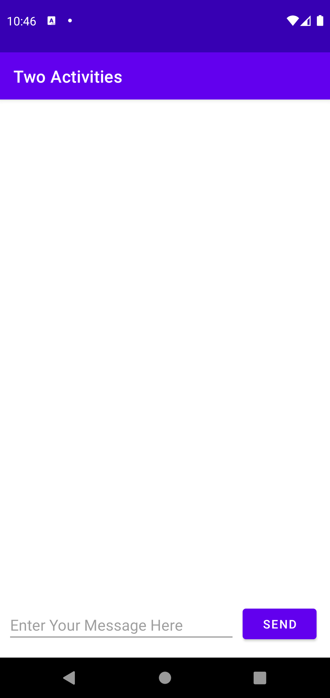
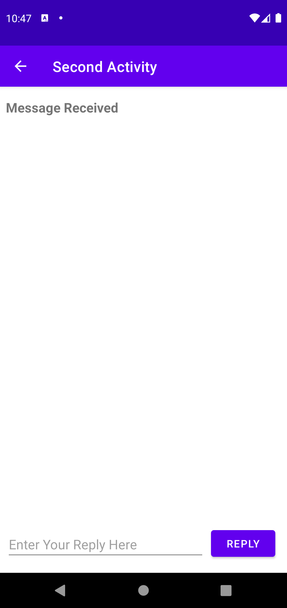
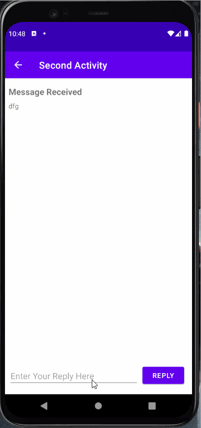
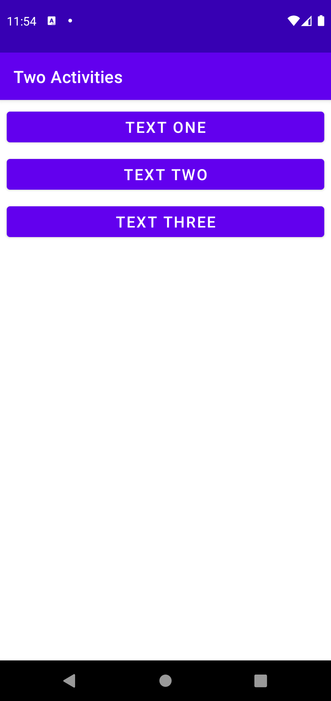
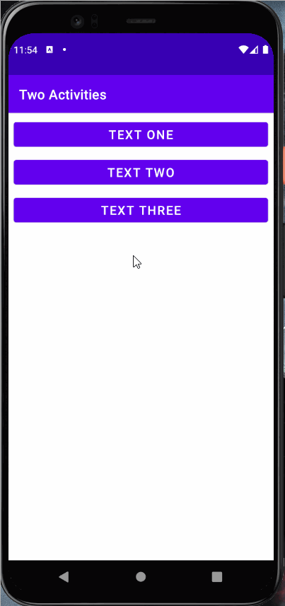
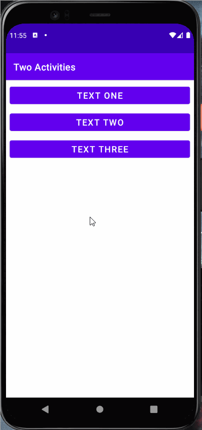
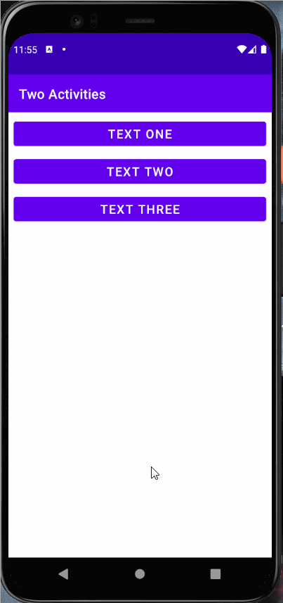
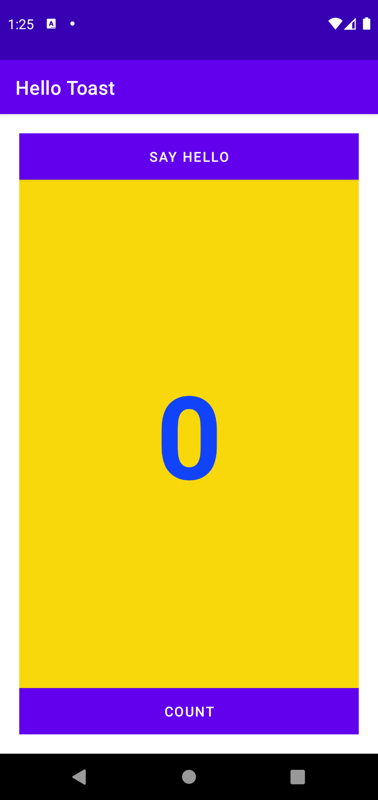
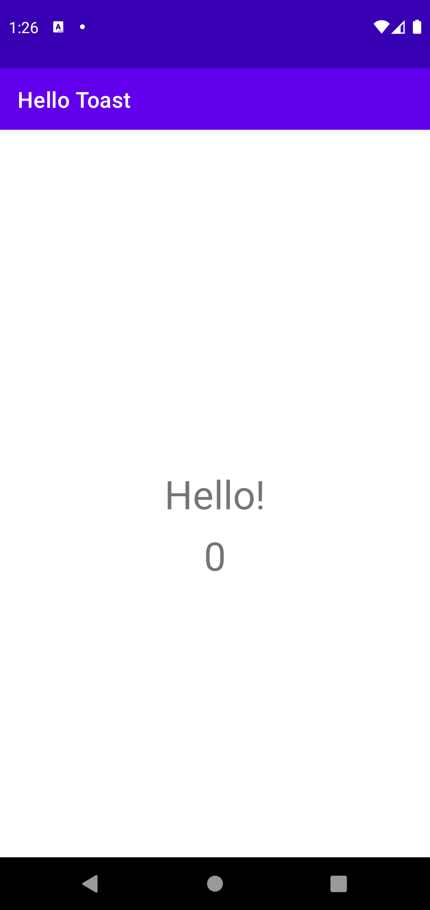
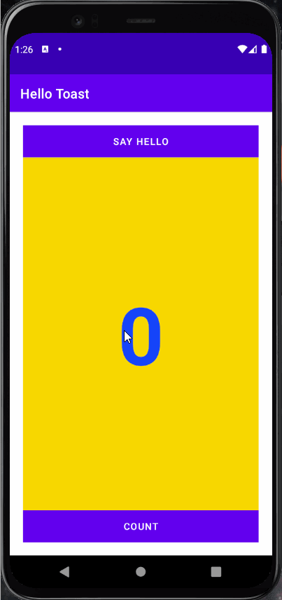

# Lab-4-TwoActivities

### Two Activities Application Overview

- Application MainActivity Index

- Application SecondActivity Index

### Two Activities Application Workings

  - Sending Message

  - Replying Message

### Two Activities Challenge Overview

- Application Index

### Hello Toast Challenge Application Workings

- Text One Button

- Text Two Button

- Text Three Button

### Hello Toast Homework Overview

- Application MainActivity Index

- Application SecondActivity Index

### Hello Toast Homework Application Workings

- Count Button

